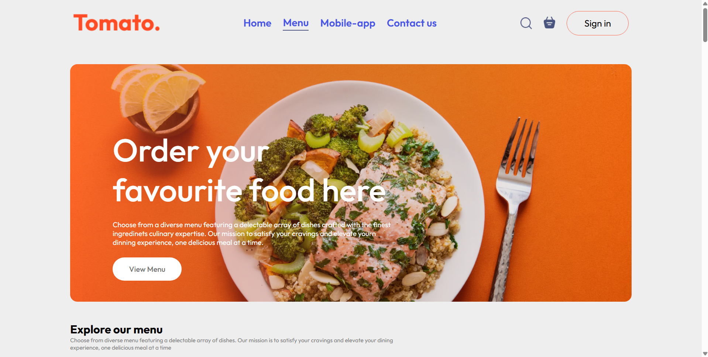

# NodeJS-Project-Idnetity-Security

## This is a food ordering website where users can select their favorite dishes and then complete the steps of confirming their address and making a payment. The website is built using React for the frontend and Node.js for the backend.

## Run Locally

Clone the project

```bash
  git clone https://github.com/Team-Nay-Manh/Nodejs-Project-Identity-Secutity.git
```

Go to the project directory

```bash
  cd frontend for UI
  cd backend for server
```

Install dependencies

```bash
  npm install (both frontend & backend) -> shorthand in terminal: npm i
```

Start the server

```bash
  npm run dev
  Frontend use port:5173 -> http://localhost:5173/
  Backend use port 5500 -> http://localhost:5500/
```

## Screenshots



## Used By

Comming soon...

## Support

For support, email VietBuoiTo@gmail.com


